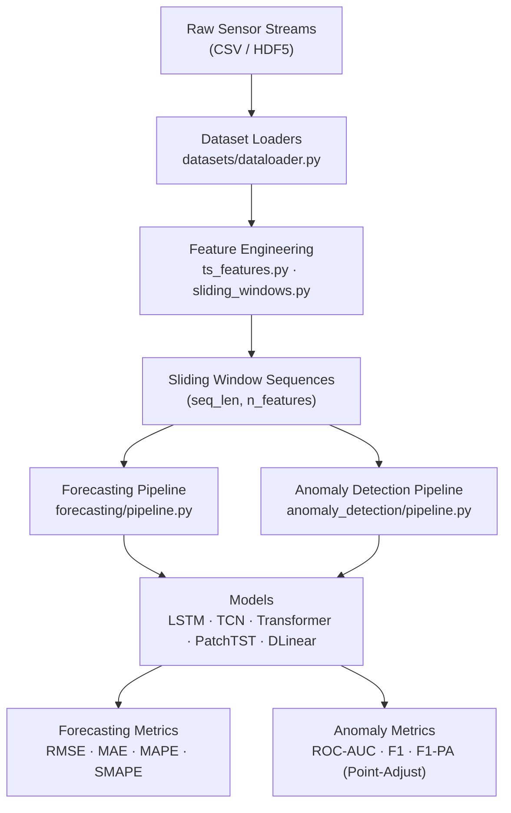

# Industrial Time-Series AI

<div align="center">


**Benchmark implementations of SOTA time-series models for industrial sensor streams.**

*Multivariate Forecasting · Anomaly Detection · Feature Engineering*

</div>

---

## Overview

Factories generate massive multivariate sensor streams that standard ML libraries handle poorly. This repository provides **reproducible SOTA baseline implementations** specifically designed for industrial IoT, ICS/SCADA systems, and smart-manufacturing data — targeting engineers and researchers in the IEEE Industrial Electronics Society community.

The framework covers the full pipeline from raw sensor streams to evaluation:

- Data loading from 6 industrial and ICS benchmark datasets
- 5 SOTA time-series model implementations (LSTM, TCN, Transformer, PatchTST, DLinear)
- Unified forecasting and anomaly detection pipelines
- Standardized evaluation metrics including Point-Adjust (PA) for ICS/SCADA benchmarks
- Feature engineering utilities for industrial time-series characteristics

---

## Table of Contents

- [Architecture](#architecture)
- [Datasets](#datasets)
- [Models](#models)
- [Benchmark Results](#benchmark-results)
- [Quick Start](#quick-start)
- [Notebooks](#notebooks)
- [Project Structure](#project-structure)
- [Citation](#citation)
- [Contributing](#contributing)

---

## Architecture



---

## Datasets

| Dataset | Domain | Features | Task | Access |
|---------|--------|:--------:|------|--------|
| **ETTh1 / ETTh2** | Power grid (hourly) | 7 | Forecasting | Free — see download script |
| **ETTm1 / ETTm2** | Power grid (15-min) | 7 | Forecasting | Free — see download script |
| **PSM** | Server metrics | 25 | Anomaly detection | Free — see download script |
| **SMAP / MSL** | NASA telemetry | Multi | Anomaly detection | Free — see download script |
| **SWaT** (synthetic) | Water treatment | 51 | Both | Built-in — no download |
| **WADI** (synthetic) | Water distribution | 123 | Anomaly detection | Built-in — no download |

```bash
# Download all free real datasets
python datasets/download_datasets.py --all

# Or selectively
python datasets/download_datasets.py --datasets ett psm
```

---

## Models

| Model | Architecture | Forecasting | Anomaly | Paper |
|-------|-------------|:-----------:|:-------:|-------|
| **LSTM** | Stacked RNN + linear head | ✓ | ✓ (autoencoder) | Hochreiter & Schmidhuber, 1997 |
| **TCN** | Causal dilated Conv1d + residual | ✓ | — | Bai et al., 2018 |
| **Transformer** | Self-attention + positional encoding | ✓ | — | Vaswani et al., NeurIPS 2017 |
| **PatchTST** | Patching + channel-independent attention | ✓ | — | Nie et al., ICLR 2023 |
| **DLinear** | Trend/residual decomposition + linear | ✓ | — | Zeng et al., AAAI 2023 |

> **DLinear insight:** Despite having far fewer parameters than Transformer-based models, DLinear matches or beats them on ETT benchmarks — highlighting that architectural inductive biases matter more than capacity for periodic industrial time-series.

All models follow a consistent `ForecastingPipeline` / `ReconstructionAnomalyPipeline` API with YAML config support.

---

## Benchmark Results

### Forecasting (SWaT Synthetic, pred_len=24, 3 epochs — noise baseline)

Results on white-noise data confirm all models converge near MSE ≈ 1.0 (theoretical limit for i.i.d. Gaussian input), verifying correct implementation. Run `python benchmarks/run_benchmark.py --task forecasting_ett` for meaningful ETT results.

| Model | RMSE | MAE | Params | Train time (s) |
|-------|------|-----|--------|----------------|
| LSTM | 0.9991 | 0.7964 | 143K | 3.4 |
| TCN | 0.9989 | 0.7962 | 135K | 3.3 |
| Transformer | 1.0006 | 0.7976 | 150K | 3.1 |
| PatchTST | 0.9993 | 0.7964 | 118K | 9.9 |
| DLinear | 1.0865 | 0.8667 | 237K | 6.5 |

### Anomaly Detection (SWaT Synthetic, 3 epochs)

| Model | ROC-AUC | F1 | F1-PA | Precision | Recall | Params |
|-------|---------|----|----- -|-----------|--------|--------|
| LSTMAutoencoder | 0.9999 | 0.9981 | **1.0000** | 1.0000 | 0.9963 | 108K |

> Full results saved to `benchmarks/results/benchmark_results.csv` after running `bash scripts/run_all_benchmarks.sh`.

---

## Quick Start

### Installation

```bash
git clone https://github.com/IEEE-IES-Industrial-AI-Lab/Industrial-Time-Series-AI
cd Industrial-Time-Series-AI
pip install -r requirements.txt
```

### Run Benchmarks (No Download Required)

```bash
# Anomaly detection on synthetic SWaT data
python benchmarks/run_benchmark.py --task anomaly

# Forecasting: all 5 models on synthetic data
python benchmarks/run_benchmark.py --task forecasting

# Full benchmark suite
bash scripts/run_all_benchmarks.sh
```

### Run on Real ETT Data

```bash
python datasets/download_datasets.py --datasets ett
python benchmarks/run_benchmark.py --task forecasting_ett
```

### Forecasting Pipeline

```python
from datasets.dataloader import get_dataset
from models.patchtst import PatchTST
from forecasting.pipeline import ForecastingPipeline

train_loader = get_dataset("ETTh1", split="train", seq_len=96, pred_len=96, batch_size=32)
val_loader   = get_dataset("ETTh1", split="val",   seq_len=96, pred_len=96, batch_size=32)

model = PatchTST(num_features=7, seq_len=96, pred_len=96, patch_len=16, stride=8)
pipeline = ForecastingPipeline(model, learning_rate=1e-3, model_name="PatchTST", pred_len=96)
metrics = pipeline.fit(train_loader, val_loader, epochs=20)
# metrics.rmse, metrics.mae, metrics.mape, metrics.smape
```

### Anomaly Detection Pipeline

```python
from datasets.dataloader import get_dummy_swat_dataloader
from models.lstm_forecasting import LSTMAutoencoder
from anomaly_detection.pipeline import ReconstructionAnomalyPipeline

train_loader = get_dummy_swat_dataloader(batch_size=64, window_size=100)
test_loader  = get_dummy_swat_dataloader(batch_size=64, window_size=100, num_samples=2000)

model = LSTMAutoencoder(num_features=51, hidden_dim=64, num_layers=2)
pipeline = ReconstructionAnomalyPipeline(model, model_name="LSTMAutoencoder")
metrics = pipeline.fit(train_loader, test_loader=test_loader, epochs=10)
# metrics.roc_auc, metrics.f1, metrics.f1_pa (point-adjust)
```

### Config-Driven Experiment

```python
from models.patchtst import PatchTST
from forecasting.pipeline import ForecastingPipeline

model = PatchTST(num_features=7, seq_len=96, pred_len=96)
pipeline = ForecastingPipeline.from_config(model, "configs/forecasting_ett.yaml")
```

### Feature Engineering

```python
from feature_engineering.ts_features import extract_all_features
import numpy as np

window = np.random.randn(100, 51)  # 100 time steps, 51 sensors
features = extract_all_features(window, sampling_rate=1.0, include_entropy=True)
# features: dict with keys mean, std, rms, spectral_entropy, approx_entropy, ...
```

---

## Notebooks

| Notebook | Topic | Dataset |
|----------|-------|---------|
| [01_forecasting_with_patchtst](tutorials/01_forecasting_with_patchtst.ipynb) | Forecasting with PatchTST end-to-end | SWaT (synthetic) |
| [02_anomaly_detection_swat](tutorials/02_anomaly_detection_swat.ipynb) | LSTM Autoencoder anomaly detection + PA metric | SWaT (synthetic) |
| [03_model_comparison_benchmark](tutorials/03_model_comparison_benchmark.ipynb) | 5-model comparison with bar charts | ETT (synthetic) |

---

## Project Structure

```
Industrial-Time-Series-AI/
│
├── datasets/
│   ├── dataloader.py           # ETTDataset, PSMDataset, factory function
│   └── download_datasets.py
│
├── models/
│   ├── lstm_forecasting.py     # LSTMForecaster + LSTMAutoencoder
│   ├── tcn_model.py            # Temporal Convolutional Network
│   ├── transformer_ts.py       # Vanilla Transformer for time-series
│   ├── patchtst.py             # PatchTST (ICLR 2023)
│   └── dlinear.py              # DLinear (AAAI 2023)
│
├── forecasting/
│   └── pipeline.py             # Train/eval loop, RMSE/MAE/MAPE/SMAPE, checkpointing
│
├── anomaly_detection/
│   └── pipeline.py             # Reconstruction loss, PA metric, threshold search
│
├── evaluation/
│   ├── forecasting_metrics.py  # RMSE, MAE, MAPE, SMAPE
│   └── anomaly_metrics.py      # F1, ROC-AUC, Point-Adjust (PA)
│
├── feature_engineering/
│   ├── ts_features.py          # Statistical, FFT, wavelet, entropy, decomposition
│   └── sliding_windows.py      # Zero-copy strided window extraction
│
├── visualization/
│   └── plot_utils.py           # Multivariate plots, anomaly overlay, model comparison
│
├── benchmarks/
│   └── run_benchmark.py        # Multi-model, multi-dataset benchmark runner
│
├── configs/                    # YAML experiment configurations
│   ├── forecasting_ett.yaml    # ETTh1, 5 models, pred_len=96
│   ├── forecasting_swat.yaml   # SWaT dummy, 3 models, pred_len=24
│   └── anomaly_detection_swat.yaml
│
├── tutorials/                  # 3 end-to-end Jupyter notebooks
└── scripts/
    └── run_all_benchmarks.sh
```

---

## Citation

If you use this framework in your research, please cite:

```bibtex
@software{ieee_ies_industrial_ts_ai_2025,
  author = {{IEEE IES Industrial AI Lab}},
  title  = {Industrial-Time-Series-AI: A Benchmark Framework for Industrial Sensor Streams},
  year   = {2025},
  url    = {https://github.com/IEEE-IES-Industrial-AI-Lab/Industrial-Time-Series-AI}
}
```

### Related Work

- Nie, Y., et al. *A time series is worth 64 words: Long-term forecasting with Transformers.* ICLR 2023.
- Zeng, A., et al. *Are Transformers effective for time series forecasting?* AAAI 2023.
- Bai, S., Kolter, J. Z., & Koltun, V. *An empirical evaluation of generic convolutional and recurrent networks for sequence modeling.* arXiv:1803.01271, 2018.
- Xu, J., et al. *Anomaly Transformer: Time series anomaly detection with association discrepancy.* ICLR 2022.
- Chen, L., et al. *TranAD: Deep Transformer Networks for anomaly detection in multivariate time series data.* VLDB 2022.

---

## Contributing

Contributions are welcome. Please open an issue before submitting a pull request.

Areas especially welcome:
- Real SWaT / WADI dataset integration (requires iTrust data request)
- Additional SOTA models (TimesNet, iTransformer, Mamba-based)
- Multi-step forecasting ablations on ETT benchmarks
- Anomaly detection on WADI and SMAP/MSL with published baselines

---

## License

MIT License — see [LICENSE](LICENSE) for details.

---

<div align="center">
Part of the <a href="https://github.com/IEEE-IES-Industrial-AI-Lab"><strong>IEEE IES Industrial AI Lab</strong></a> research initiative.
</div>
